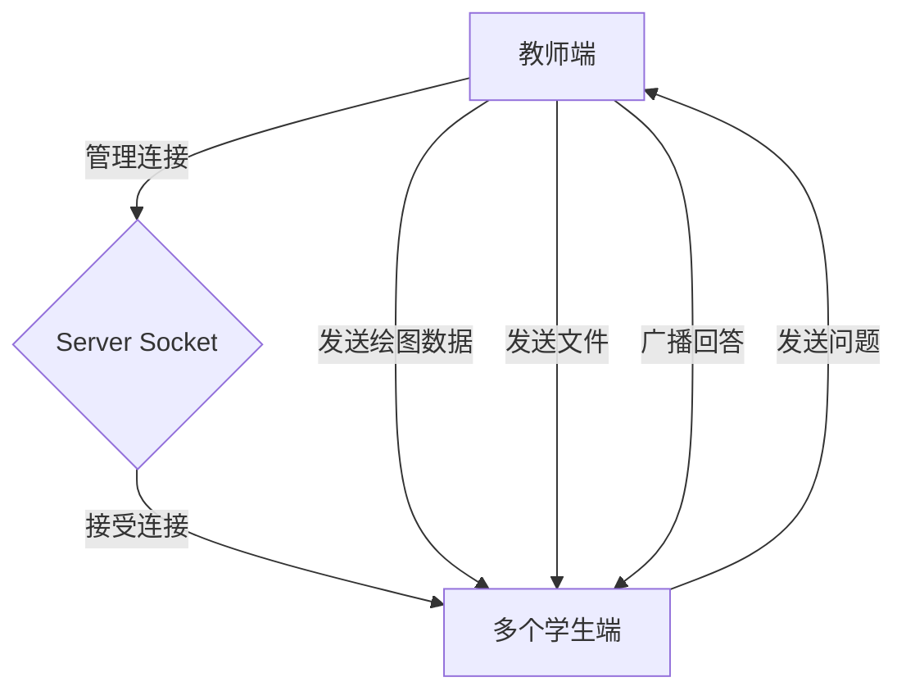
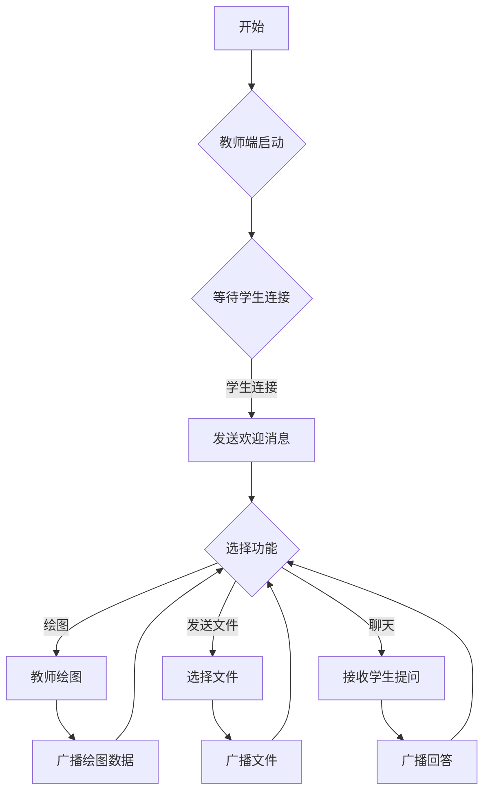
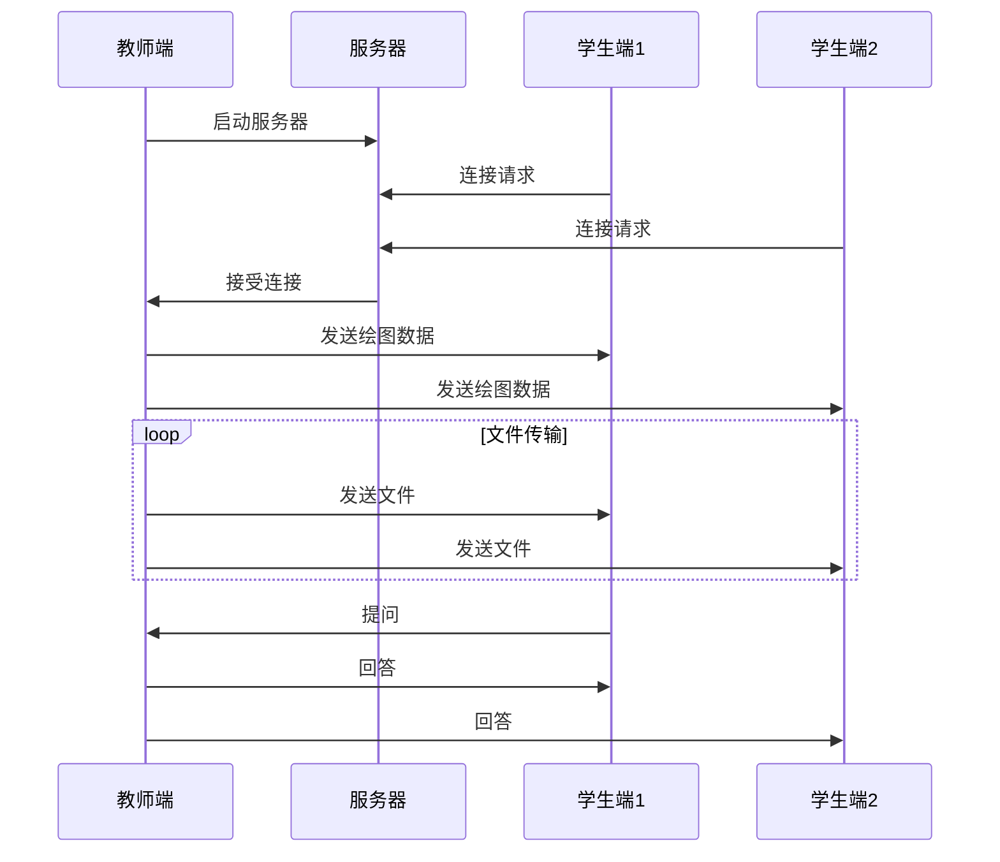
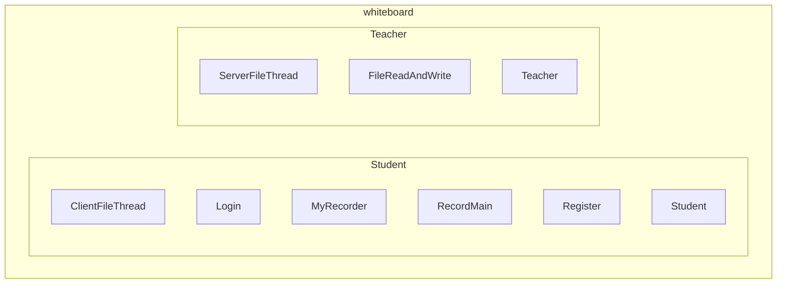
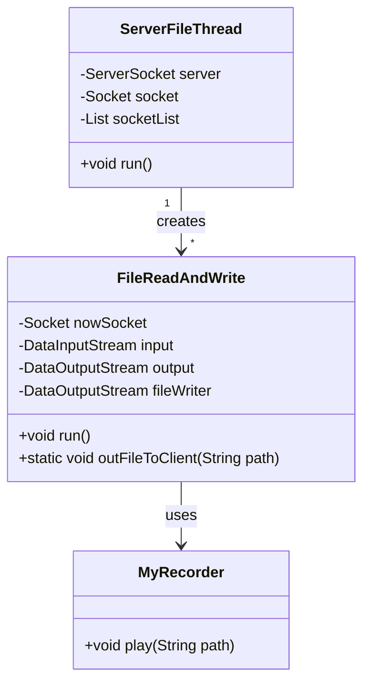
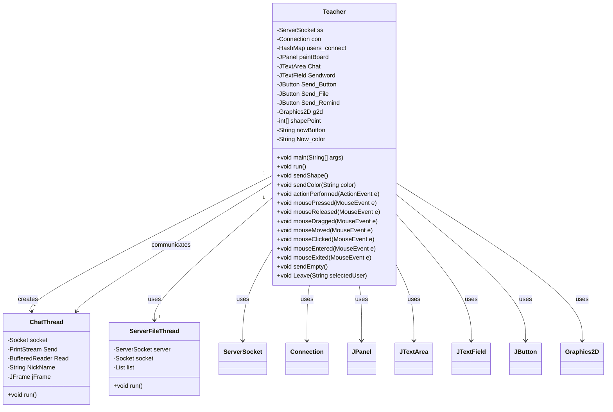
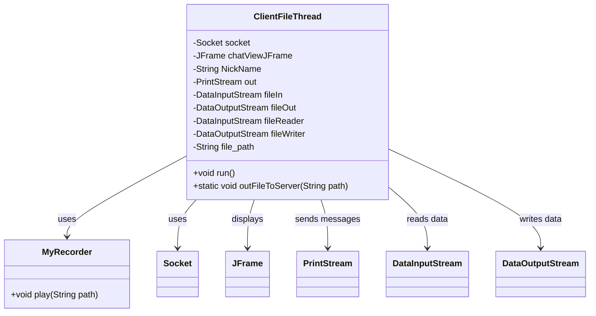
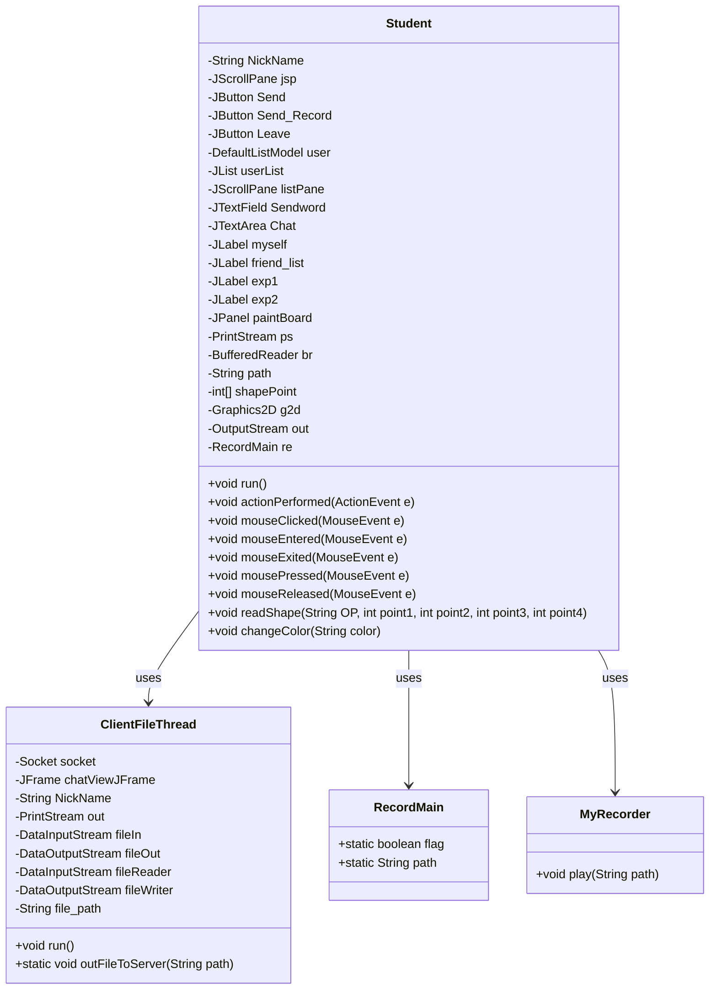
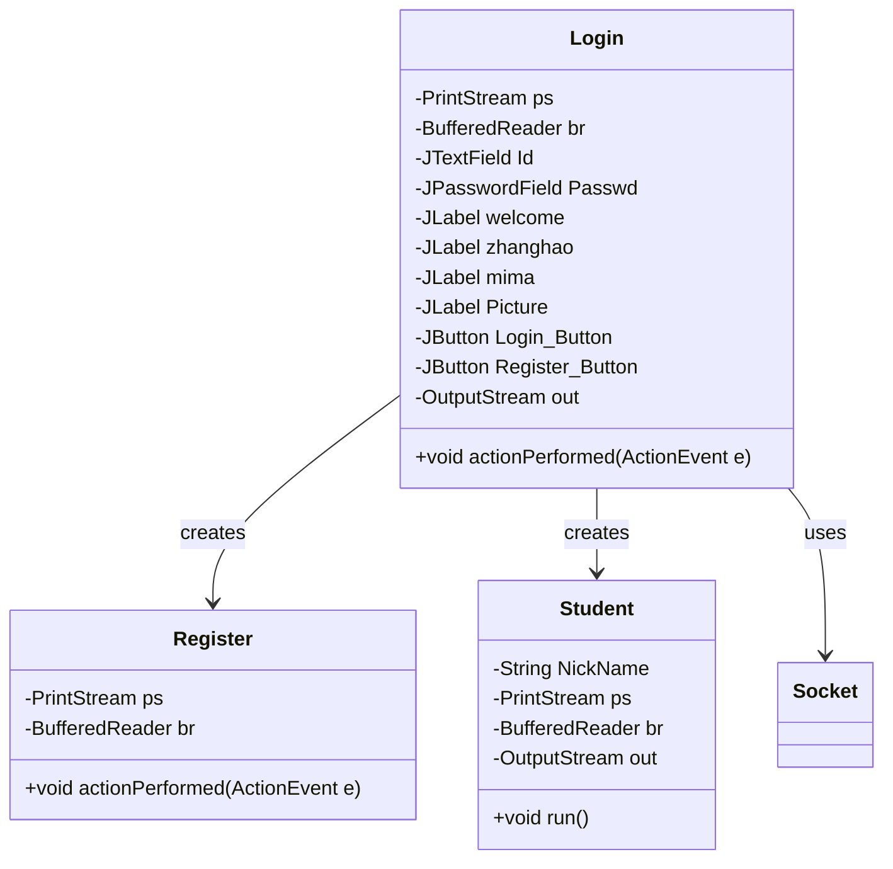
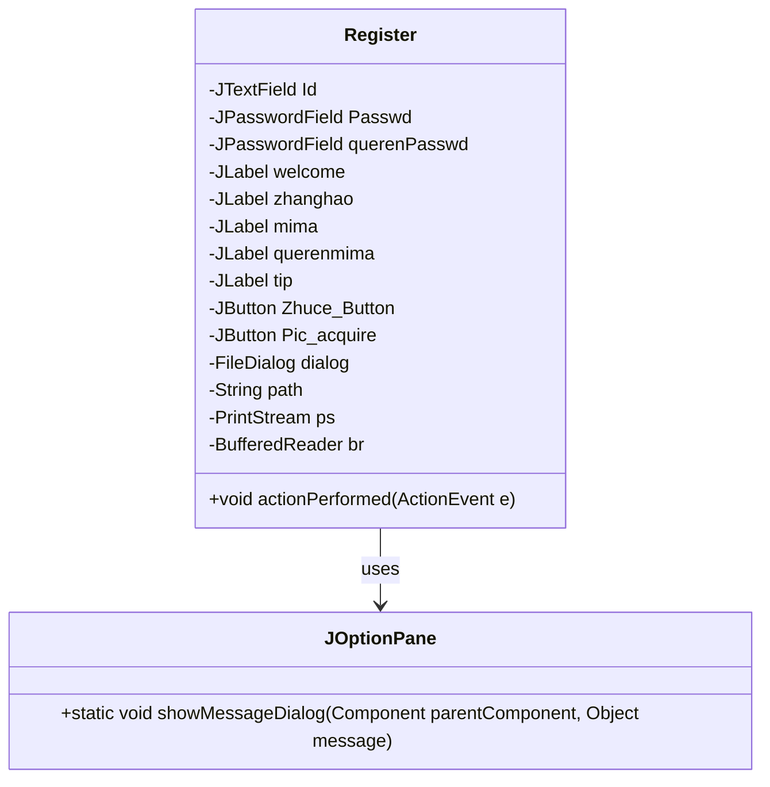

# 目录

[TOC]

> [!CAUTION]  
>
> 为了保证实验报告的逻辑顺序，我把源代码插在实验报告中间，如果造成阅读不便可以打开目录阅读。


# 实验要求

## 实践基本要求

1. 了解实验目的及实验原理；
2. 编写程序，并附上程序代码和结果图；
3. 总结在编程过程中遇到的问题、解决办法和收获。


## 实践的内容或要求

1. 编写图形用户界面，教师为服务器端，学生为客户端，一个服务端可以接受多个客户端连接。
2. 要求完成教师白板的建立,实现教师在白板上画图，学生端能够实时刷新。
3. 教师可以传输文件给学生。
4. 学生可以向教师提问，问答内容所有学生都能看到。


# 实验环境

* 编程语言：Java 19.0.2
* 文档排版：GFMarkdown 0.29.0.gfm.13


# 需求分析


## 需求1：编写图形用户界面，教师为服务器端，学生为客户端，一个服务端可以接受多个客户端连接

**功能需求**：需要一个能够支持多用户同时在线的互动系统，其中教师作为主控端（服务器），学生作为接收端（客户端）。

**技术需求**：

- **网络通信**：使用Java Socket编程实现基于TCP/IP的网络通信，确保数据传输的可靠性。
- **多线程处理**：服务器端使用多线程技术来处理多个客户端的连接请求和数据传输，每个客户端连接生成一个新的线程。
- **图形用户界面**：使用Java Swing库构建教师端和学生端的GUI，包括绘图板、按钮、输入框等组件。


## 需求2：完成教师白板的建立，实现教师在白板上画图，学生端能够实时刷新

**功能需求**：教师在白板上进行绘图操作，学生端能够实时接收并显示教师的绘图内容。

**技术需求**：

- **实时数据同步**：绘图数据（如笔迹坐标、颜色等）通过建立的Socket连接实时发送给所有学生端。
- **自定义协议**：定义一套简单的协议来标识不同的绘图操作，如“MOVE”，“DRAW”，“COLOR”等，以便快速解析和渲染。
- **图形渲染**：在学生端使用Java的Graphics2D类进行图形绘制，根据接收到的数据更新界面。


## 需求3：教师可以传输文件给学生

**功能需求**：教师端能够选择文件并发送给所有学生端，学生端能够接收并保存文件。

**技术需求**：

- **文件传输功能**：通过Socket连接传输文件。首先发送文件元数据（如名称和大小），随后发送文件数据。
- **流控制**：实现流量控制，避免大文件传输时对网络造成拥堵。
- **文件接收反馈**：学生端接收文件后向服务器反馈接收状态，确保文件传输的完整性。


## 需求4：学生可以向教师提问，问答内容所有学生都能看到

**功能需求**：实现一个实时聊天系统，学生能够发送消息给教师，所有学生可以看到教师与学生的所有对话。

**技术需求**：

- **广播消息系统**：教师端接收到学生提问后，将问题和回答广播给所有在线的学生。
- **消息队列**：使用消息队列管理发送的消息，确保消息的有序性和一致性。
- **实时更新UI**：聊天信息更新时，界面需要实时刷新显示最新消息。


# 总体设计


## 架构图




## 活动图




## 顺序图




## 包图




# 实验步骤

系统核心功能包括：图形界面的实现、白板同步、文件传输和实时聊天功能。以下是实验步骤的详细描述和具体代码实现。


## 1. 图形化界面设计

为了实现用户友好的交互环境，我需要为教师和学生创建直观的图形用户界面。教师端和学生端的界面都使用Java Swing库来构建。

**教师端界面：**

- **教师端主窗体**：利用`JFrame`组件创建主窗体，设定适当的尺寸，确保所有子组件（如按钮、画板等）都能合理布局。
- **白板绘图区**：`JPanel`被用作绘图区域，通过重写其`paintComponent(Graphics g)`方法，使其能响应绘图操作。此方法中，你可以调用`Graphics`对象的绘图方法（如`drawLine`，`drawOval`等）来渲染图形。
- **工具按钮**：通过添加一系列`JButton`到界面，每个按钮对应一种绘图工具。为每个按钮设置`ActionListener`，在事件处理方法中改变当前的绘图模式或颜色。
- **颜色选择器**：使用`JButton`数组，为每种颜色设置一个按钮，点击时改变当前绘图颜色。
- **信息显示区**：使用`JTextArea`显示聊天和系统信息。

**学生端界面：**
- **学生端主窗体**：同样使用`JFrame`类，界面布局与教师端相似但更简化。
- **白板接收区**：使用`JPanel`监听从教师端接收的绘图数据，并在本地进行渲染。


**教师端界面**

教师端的图形用户界面需要包含绘图板、文件发送按钮、以及实时聊天窗口。以下是创建这些组件的关键代码片段：

```java
// 教师端主界面的构造函数
public Teacher() throws Exception {
    // 设置布局
    this.setLayout(new BorderLayout());

    // 初始化画板
    JPanel paintBoard = new JPanel();
    paintBoard.setBorder(new TitledBorder("绘图区"));
    this.add(paintBoard, BorderLayout.CENTER);

    // 聊天区域
    JTextArea chatArea = new JTextArea(10, 30);
    chatArea.setEditable(false);
    JScrollPane chatScroll = new JScrollPane(chatArea);
    chatScroll.setBorder(new TitledBorder("聊天窗口"));
    this.add(chatScroll, BorderLayout.SOUTH);

    // 工具区
    JPanel toolPanel = new JPanel();
    JButton sendFileButton = new JButton("发送文件");
    sendFileButton.addActionListener(e -> sendFile());
    toolPanel.add(sendFileButton);
    this.add(toolPanel, BorderLayout.NORTH);

    // 显示窗口
    this.setTitle("教师端");
    this.setSize(800, 600);
    this.setDefaultCloseOperation(JFrame.EXIT_ON_CLOSE);
    this.setVisible(true);
}

```

在上述代码中，我使用了Java Swing库来设计GUI。`JPanel` 用于绘图板和工具栏的布局，`JTextArea` 用于显示聊天记录，同时包含一个滚动条。文件发送按钮通过添加动作监听器，关联到文件发送功能。


**学生端界面**

学生端界面与教师端类似，也包含绘图板和聊天窗口，但不需要文件发送按钮：

```java
// 学生端主界面的构造函数
public Student() {
    this.setLayout(new BorderLayout());

    // 初始化画板
    JPanel paintBoard = new JPanel();
    paintBoard.setBorder(new TitledBorder("绘图区"));
    this.add(paintBoard, BorderLayout.CENTER);

    // 聊天区域
    JTextArea chatArea = new JTextArea(10, 30);
    chatArea.setEditable(false);
    JScrollPane chatScroll = new JScrollPane(chatArea);
    chatScroll.setBorder(new TitledBorder("聊天窗口"));
    this.add(chatScroll, BorderLayout.SOUTH);

    // 显示窗口
    this.setTitle("学生端");
    this.setSize(800, 600);
    this.setDefaultCloseOperation(JFrame.EXIT_ON_CLOSE);
    this.setVisible(true);
}

```


## 2. 实现白板的同步

白板同步是本系统的核心功能之一，要求教师端的绘图操作能实时反映在所有学生端。白板同步是通过网络连接实现的，教师端的操作需要被实时地同步到每个连接的学生端。

**教师端**：

- **捕获绘图事件**：在教师端的`MouseListener`和`MouseMotionListener`中捕获鼠标的移动和点击事件，根据当前的绘图模式处理绘图逻辑。
- **发送绘图数据**：将绘图动作（如起始点、结束点、颜色、形状等）封装成消息，通过与学生端建立的Socket连接发送。当绘图事件触发时，相关的图形参数（如起点、终点、颜色等）被封装成一个对象，通过建立的Socket连接发送到服务器，服务器再广播给所有学生端。

**学生端**：
- **接收绘图数据**：学生端持续监听来自服务器的输入流。监听Socket连接，解析接收到的绘图数据。
- **更新界面**：根据接收到的数据在学生端的白板上绘制图形。当接收到绘图数据时，根据数据内容在本地白板上使用图形API进行绘制，从而实时更新画面。


教师端的每次绘图操作需要实时同步到所有连接的学生端。为此，我在教师端捕获鼠标事件，并通过网络将绘图数据发送给学生端。


**捕获绘图事件**

```java
// 在教师端的绘图板上添加鼠标监听器
paintBoard.addMouseListener(new MouseAdapter() {
    public void mousePressed(MouseEvent e) {
        sendDraw(e.getX(), e.getY(), 'start');
    }

    public void mouseReleased(MouseEvent e) {
        sendDraw(e.getX(), e.getY(), 'end');
    }
});

// 发送绘图数据到学生端
private void sendDraw(int x, int y, char type) {
    for (Socket socket : studentSockets) {
        PrintWriter out = new PrintWriter(socket.getOutputStream(), true);
        out.println(type + "," + x + "," + y);
    }
}

```


**学生端接收绘图数据**

```java
// 学生端监听来自教师端的数据
BufferedReader input = new BufferedReader(new InputStreamReader(socket.getInputStream()));
String line;
while ((line = input.readLine()) != null) {
    String[] parts = line.split(",");
    if (parts[0].equals("start")) {
        // 开始绘图
    } else if (parts[0].equals("end")) {
        // 结束绘图
    }
    repaint();
}

```


## 3. 文件的传输

文件传输功能允许教师端向学生端发送教学资料或其他文件。

**教师端**：
- **选择文件发送**：使用`JFileChooser`让教师选择文件，读取文件内容并通过Socket发送。
- **发送文件信息**：首先发送文件的基本信息（如文件名和大小），然后发送文件内容。

**学生端**：

- **接收文件信息和内容**：持续监听来自教师端的数据。接收到文件数据首先显示文件基本信息，然后接收文件内容，并保存到指定目录。


教师端通过选择文件后，将文件内容发送到所有连接的学生端。这里我使用Java的`FileInputStream`来读取文件内容，并通过套接字发送。

**教师端发送文件**

```java
private void sendFile() {
    JFileChooser fileChooser = new JFileChooser();
    if (fileChooser.showOpenDialog(null) == JFileChooser.APPROVE_OPTION) {
        File file = fileChooser.getSelectedFile();
        byte[] buffer = new byte[4096];
        int bytesRead;
        for (Socket socket : studentSockets) {
            BufferedOutputStream output = new BufferedOutputStream(socket.getOutputStream());
            BufferedInputStream fileInput = new BufferedInputStream(new FileInputStream(file));
            while ((bytesRead = fileInput.read(buffer)) != -1) {
                output.write(buffer, 0, bytesRead);
                output.flush();
            }
            fileInput.close();
        }
    }
}

```


**学生端接收文件**

```java
// 学生端接收文件
BufferedInputStream input = new BufferedInputStream(socket.getInputStream());
FileOutputStream fileOutput = new FileOutputStream("received_" + fileName);
byte[] buffer = new byte[4096];
int bytesRead;
while ((bytesRead = input.read(buffer)) != -1) {
    fileOutput.write(buffer, 0, bytesRead);
}
fileOutput.close();

```


## 4. 聊天问答功能

聊天问答功能让学生可以直接向教师提问，教师回答后所有学生都能看到这些信息。

**实现流程**：

- **学生发送问题**：学生通过聊天界面输入问题，通过按钮事件触发后通过Socket发送到服务器。
- **教师接收和回答**：教师端接收问题，回答后将答案发送回服务器，服务器再广播给所有学生。
- **学生接收回答**：所有学生接收到问题和教师的回答，并在各自的聊天界面显示。


**学生端发送问题并接收回答**

```java
// 发送问题
String question = JOptionPane.showInputDialog(this, "输入问题:");
PrintWriter out = new PrintWriter(socket.getOutputStream(), true);
out.println(question);

// 接收回答
BufferedReader input = new BufferedReader(new InputStreamReader(socket.getInputStream()));
String answer;
while ((answer = input.readLine()) != null) {
    chatArea.append(answer + "\n");
}

```


**教师端接收并回答问题**

```java
// 教师端接收问题
BufferedReader reader = new BufferedReader(new InputStreamReader(socket.getInputStream()));
String question = reader.readLine();
chatArea.append("学生问：" + question + "\n");

// 发送回答
String answer = JOptionPane.showInputDialog(this, "回答学生问题:");
for (Socket socket : studentSockets) {
    PrintWriter out = new PrintWriter(socket.getOutputStream(), true);
    out.println("教师答：" + answer);
    chatArea.append("教师答：" + answer + "\n");
}

```


通过上述步骤，就建立了一个功能完整的教师-学生互动的白板工具，不仅支持实时的图形绘制和同步，还能进行文件传输和实时聊天互动等等功能。这些功能的实现极大地增强了教学的互动性和灵活性。


# 代码实现

这样的分析顺序基于功能模块的依赖性和执行流程，从核心的服务器功能（教师端）开始，逐步过渡到客户端功能（学生端），最后是辅助功能（登录和注册）。有助于系统地理解整个应用程序的工作流程和各个组件之间的交互。


## 1. ServerFileThread.java

   - **功能**：这个文件主要负责教师端的文件传输功能。
   - **逻辑**：分析这个文件首先是因为它处理文件传输，包括文件的接收和发送逻辑。在项目中，这个功能是跨客户端（学生端）的基础服务之一


### 类图



**ServerFileThread**：这个类用于监听和接受客户端连接，并为每个连接创建一个`FileReadAndWrite`线程来处理文件传输。该类具备一个`ServerSocket`用于监听，一个`Socket`用于与客户端通信，以及一个列表来维护所有的客户端连接。

**FileReadAndWrite**：这个类用于实际的文件传输功能。它接收来自客户端的文件名和文件长度，然后将文件内容发送给所有其他客户端。此外，该类还负责将文件保存到服务器的本地目录，并使用`MyRecorder`类播放接收到的音频文件。

**MyRecorder**：此类用于播放接收到的录音文件。`FileReadAndWrite`类在接收并保存完文件后调用此类的`play`方法。


### 代码

```java

```


## 2. Teacher.java

   - **功能**：实现教师端的用户界面和所有教师端功能，包括绘图、聊天、文件发送和处理客户端（学生端）连接。
   - **逻辑**：此文件是服务器端的核心，管理连接、处理所有来自客户端的请求和数据同步，因此是理解整个服务器端逻辑的关键。


### 类图



**Teacher**: 这个类是整个教师端应用的核心。它处理UI组件的初始化，数据库连接，和基于TCP/IP的Socket通信。它还负责管理用户的绘图和消息传递功能。

**ChatThread**: 每个学生连接到教师端时，`Teacher`类会为每个连接创建一个`ChatThread`。这个线程负责处理与单个学生的通信，如接收登录信息、处理消息发送和接收。

**ServerFileThread**: 负责管理文件传输功能，处理文件的接收和发送给所有连接的客户端。

**绘图与事件处理**: `Teacher`类通过实现`MouseListener`和`MouseMotionListener`来捕捉和处理鼠标事件，从而在白板上进行绘图。这些绘图动作随后通过网络同步到所有学生端。

**动作和事件监听**: `Teacher`类还处理来自UI（如按钮点击）的事件，执行相应的操作（如发送文件、消息等）。


### 代码

```java

```


## 3. ClientFileThread.java
   - **功能**：管理学生端的文件接收。
   - **逻辑**：理解学生端如何接收从教师端发送的文件，这对于确保文件传输功能的完整性至关重要。


### 类图



**ClientFileThread**: 这个类主要负责处理学生端的文件接收和发送功能。它通过网络连接到服务器，并根据服务器指示接收或发送文件。

**Socket**: `ClientFileThread`使用Socket进行网络通信，这是进行文件传输的基础。

**JFrame**: 用于提供图形用户界面，以便显示接收文件的确认对话框等。

**PrintStream**: 用于发送消息，比如发送文件传输相关的提醒信息。

**DataInputStream** 和 **DataOutputStream**: 这两个流用于读取从服务器传来的文件数据和向服务器发送文件数据。


### 代码

```java

```


## 4. Student.java
   - **功能**：实现学生端的用户界面和功能，包括接收教师端的绘图数据、文件、聊天消息等。
   - **逻辑**：这是学生客户端的主文件，分析此文件有助于理解学生端如何处理来自教师端的各种数据和请求。

### 类图




**Student**: 这个类是学生端应用的核心。它负责管理学生端的图形用户界面，处理用户的输入，以及与服务器的通信。

**ClientFileThread**: 学生端使用这个类来处理文件的接收和发送。它在学生端的生命周期中起着重要的辅助通信角色。

**事件监听和处理**: `Student`类实现了`ActionListener`和`MouseListener`接口，用来处理各种GUI事件，如按钮点击和鼠标事件，以及发送绘图数据到服务器。

**图形绘制**: 学生端使用`Graphics2D`对象在`paintBoard`上进行绘图，绘图动作依赖于从服务器接收的指令。


### 代码

```java

```


## 5. Login.java
   - **功能**：处理学生端的登录逻辑。
   - **逻辑**：登录是用户接入服务的第一步，分析这部分可以理解用户如何被验证并接入系统。


### 类图



**Login**: 这个类负责提供图形用户界面用于登录和注册。它包含用于输入用户名和密码的文本字段，以及用于提交这些信息到服务器的按钮。

**Socket**: `Login`类使用`Socket`来与服务器建立连接，通过这个连接发送登录请求并接收服务器的响应。

**PrintStream** 和 **BufferedReader**: 这些是用于发送数据到服务器并从服务器接收数据的流对象。

**Register** 和 **Student**: 当用户点击注册按钮时，`Login`类会创建一个`Register`类的实例来处理注册逻辑。登录成功后，它会创建一个`Student`类的实例并将用户登录信息传递给它，从而允许用户进入学生端的主界面。


### 代码

```java

```


## 6. Register.java
   - **功能**：处理学生端的用户注册逻辑。
   - **逻辑**：注册是新用户加入系统的关键步骤，理解这一部分有助于掌握用户如何创建新账户并存储其信息。


### 类图



**Register**: 这个类负责提供用户注册的图形用户界面，包括账号、密码、确认密码的输入字段以及头像选择和注册按钮。

**JTextField** 和 **JPasswordField**: 这些组件用于用户输入数据。`Id`用于输入用户名，`Passwd`和`querenPasswd`用于输入和确认密码。

**JButton**: `Zhuce_Button`用于触发注册操作，而`Pic_acquire`用于打开文件对话框选择头像。

**JOptionPane**: 用于显示各种通知消息，如错误信息或注册成功的确认。

**PrintStream** 和 **BufferedReader**: 这些是网络通信的关键部分，`ps`用于发送注册信息到服务器，`br`用于接收服务器响应。


### 代码

```java

```


# 实验结果

已删除


# 心得体会

已删除
